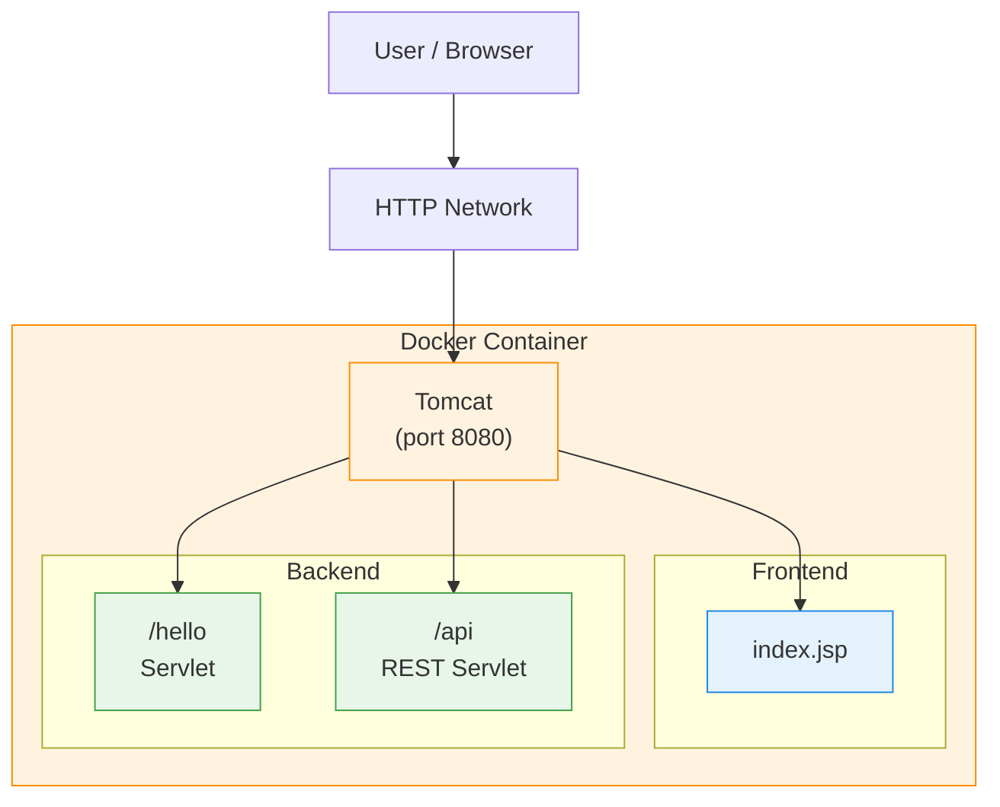

# Java WAR Demo (Tomcat + Docker + GitHub Actions)

Demo simple de una **aplicación web Java (frontend + backend)** empaquetada como **WAR**, desplegada en **Apache Tomcat** dentro de **Docker**, con **GitHub Actions** para CI/CD.

La demo cubre un flujo típico:
1. Compilar proyecto Java
2. Generar archivo WAR
3. Construir imagen Docker usando Tomcat
4. Publicar imagen en Docker Hub

---

## 🧱 Arquitectura



---

## 📁 Estructura del proyecto

```
java-war-demo/
├─ Dockerfile
├─ Containerfile
├─ build.gradle
├─ settings.gradle
├─ pom.xml
├─ README.md
├─ README.EN.md
├─ .github/
│  └─ workflows/
│     └─ gradle-containerfile.yml
│     └─ maven-dockerfile.yml
└─ src/
   └─ main/
      ├─ java/
      │  └─ com/demo/
      │     ├─ HelloServlet.java
      │     └─ ApiServlet.java
      └─ webapp/
         ├─ index.jsp
         └─ WEB-INF/
            └─ web.xml
```

---

## ☕ Requisitos

### Local
- Java 17+
- Maven 3.9+
- Gradle 9.2+
- Docker
- Podman

### CI/CD
- Cuenta en Docker Hub
- Repositorio en GitHub

---

## 🚀 Compilación local (WAR)

### Using Maven
Desde la carpeta donde está el `pom.xml`:

```bash
mvn -DskipTests package
```

Salida esperada:

```
target/app.war
```

### Using Gradle
From the directory containing `build.gradle` and `settings.gradle`:

```bash
gradle clean war
```

Expected output:

```
build/libs/app-gradle.war
```

---

## 🐳 Construcción y ejecución com Docker (local)

### Build de la imagen
```bash
docker build -f Dockerfile -t java-war-demo:local .
```

### Ejecutar contenedor
```bash
docker run --rm -p 8080:8080 java-war-demo:local
```

## 🐧 Construcción y ejecución com Podman (Local)

### Build image
```bash
podman build -f Containerfile -t java-war-demo:local .
```

### Run container
```bash
podman run --rm -p 8080:8080 java-war-demo:local
```

### URLs de prueba

- Frontend: http://localhost:8080/app/
- Servlet: http://localhost:8080/app/hello
- API: http://localhost:8080/app/api

---

## 📦 Dockerfile (resumen)

- Usa imagen oficial `tomcat:10.1-jdk17`
- Elimina apps por defecto
- Copia únicamente el WAR generado
- Arranca Tomcat en modo foreground

Esto mantiene la imagen simple y eficiente para demos.

---

## 🔁 CI/CD con GitHub Actions

Pipeline definido en:

```
.github/workflows/gradle-containerfile.yml
.github/workflows/maven-dockerfile.yml
```

### Pasos del pipeline

1. Checkout del código
2. Setup Java 21
3. Build del WAR con Maven o Gradle
4. Login a Docker Hub
5. Build de la imagen Docker o Podman
6. Push a Docker Hub

### Secrets requeridos

Configurar en **Settings → Secrets and variables → Actions**:

| Secret | Descripción |
|------|-------------|
| `DOCKERHUB_USERNAME` | Usuario de Docker Hub |
| `DOCKERHUB_TOKEN` | Access Token de Docker Hub |

---

## 🏷️ Tags de la imagen

El pipeline publica la imagen con:

- `latest`
- `sha-<commit>`

Ejemplo:
```
docker pull usuario/java-war-demo:latest
```

---

## 🧪 Objetivo de la demo

Esta demo está pensada para:

- Mostrar un flujo **Java tradicional (WAR + Tomcat)**
- Explicar pipelines CI/CD básicos
- Servir como base para entrevistas DevOps / Cloud
- Evolucionar luego a:
  - Kubernetes
  - Helm
  - ECS / EKS / AKS
  - Versionado semántico

---

## 📝 Licencia

Demo educativa – uso libre para pruebas y aprendizaje.

---

💡 **Tip DevOps**: este proyecto es ideal para explicar la diferencia entre *build-time* (WAR) y *runtime* (Tomcat container).
