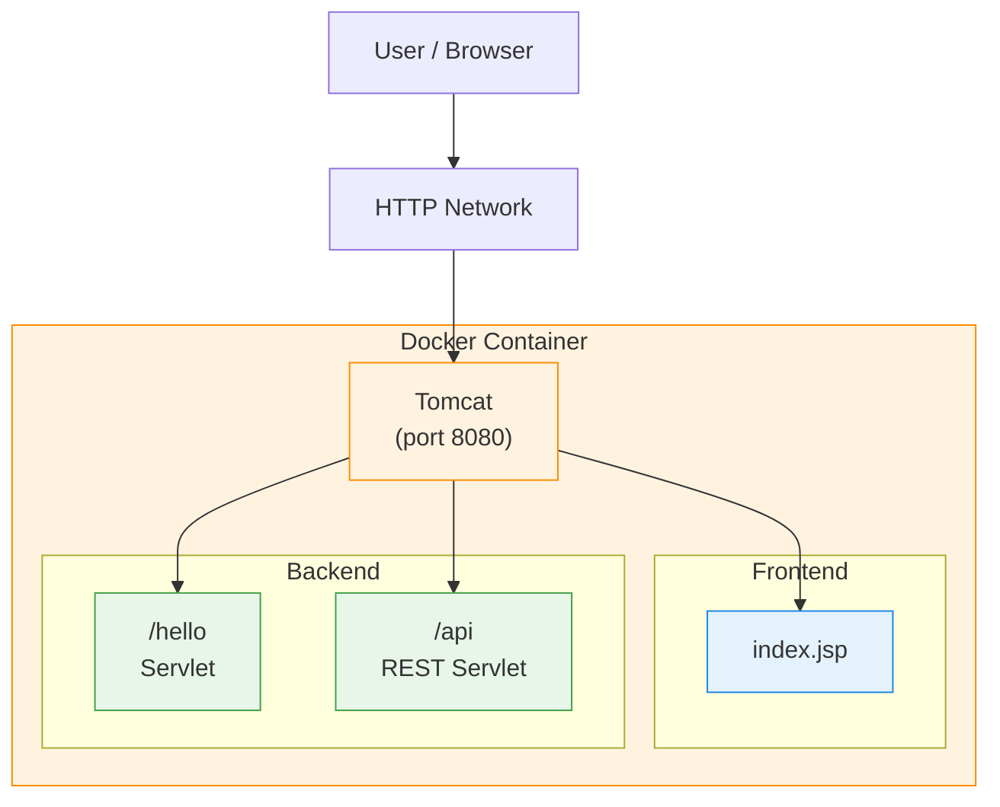

# Java WAR Demo (Tomcat + Docker / Podman + GitHub Actions)

Simple demo of a  **Java web application (frontend + backend)** packaged as a  **WAR**, deployed on  **Apache Tomcat** running inside a container (**Docker** or **Podman**), with GitHub Actions for CI/CD and image publishing to  **Docker Hub** or  **GitHub Container Registry (GHCR)**.

This demo covers a typical flow:
1. Compile Java project
2. Generate WAR file
3. Build container image using Tomcat
4. Push image to Docker Hub or GitHub Container Registry (GHCR)

---

## 🧱 Architecture



---

## 📁 Project Structure

```
java-war-demo/
├─ Dockerfile
├─ Containerfile
├─ build.gradle
├─ settings.gradle
├─ pom.xml
├─ README.md
├─ README.EN.md
├─ .github/
│  └─ workflows/
│     └─ gradle-containerfile.yml
│     └─ maven-dockerfile.yml
└─ src/
   └─ main/
      ├─ java/
      │  └─ com/demo/
      │     ├─ HelloServlet.java
      │     └─ ApiServlet.java
      └─ webapp/
         ├─ index.jsp
         └─ WEB-INF/
            └─ web.xml
```

---

## ☕ Requirements

### Local
- Java 17+
- Maven 3.9+
- Gradle 9.2+
- Docker
- Podman

### CI/CD
- GitHub repository
- Docker Hub account

---

## 🚀 Local Build (WAR)

### Using Maven
From the directory containing `pom.xml`:

```bash
mvn -DskipTests package
```

Expected output:

```
target/app-maven.war
```

### Using Gradle
From the directory containing `build.gradle` and `settings.gradle`:

```bash
gradle clean war
```

Expected output:

```
build/libs/app-gradle.war
```

---

## 🐳 Docker Build & Run (Local)

### Build image
```bash
docker build -f Dockerfile -t java-war-demo:local .
```

### Run container
```bash
docker run --rm -p 8080:8080 java-war-demo:local
```

## 🐧 Podman Build & Run (Local)

### Build image
```bash
podman build -f Containerfile -t java-war-demo:local .
```

### Run container
```bash
podman run --rm -p 8080:8080 java-war-demo:local
```

### Test URLs

- Frontend: http://localhost:8080/app/
- Servlet: http://localhost:8080/app/hello
- API: http://localhost:8080/app/api

---

## 📦 Dockerfile (Summary)

- Uses official `tomcat:10.1-jdk21-temurin` image
- Removes default applications
- Copies only the generated WAR
- Runs Tomcat in foreground mode

This keeps the image simple and efficient for demo purposes.

---

## 🔁 CI/CD with GitHub Actions

### Defined pipeline for using Maven, Docker, and Docker Hub in:

```
.github/workflows/maven-dockerfile.yml
```

### Pipeline steps

1. Checkout source code
2. Setup Java 21
3. Build WAR using Maven
4. Login to Docker Hub
5. Build Docker image
6. Push image to Docker Hub

### Required secrets

Configure in **Settings → Secrets and variables → Actions**:

| Secret | Descripción |
|------|-------------|
| `DOCKERHUB_USERNAME` | Docker Hub username |
| `DOCKERHUB_TOKEN` | Docker Hub access token |

### Defined pipeline for using Gradle, Podman, and GHCR in:

```
.github/workflows/gradle-containerfile.yml
```

### Pipeline steps

1. Checkout source code
2. Setup Java 21
3. Build WAR using Gradle
4. Login to GitHub Container registry (GHCR)
5. Build Podman image
6. Push image to GitHub Container registry (GHCR)

### Required secrets

Configure in **Settings → Secrets and variables → Actions**:

| Secret | Descripción |
|------|-------------|
| `GITHUB_TOKEN` | Automatically provided by GitHub Actions (no manual creation required) |

---

## 🏷️ Image Tags

The pipeline publishes images with:

- `latest`
- `sha-<commit>`

Example Docker Hub:
```
docker pull <dockerhub-user>/java-war-demo:latest
```

Example GHCR:
```
docker pull ghcr.io/<github-org-or-user>/java-war-demo:latest
```

---

## 🧪 Demo Purpose

This demo is intended to:

- Demonstrate traditional **Java deployment (WAR + Tomcat)**
- Explain basic CI/CD pipelines
- Serve as a base for DevOps / Cloud interviews
- Be extended later to:
  - Kubernetes
  - Helm
  - ECS / EKS / AKS
  - Semantic versioning

---

## 📝 License

Educational demo – free to use for learning and testing.

---

💡 **DevOps Tip**: this project is ideal for explaining the difference between build-time (WAR generation) and runtime (Tomcat container).
